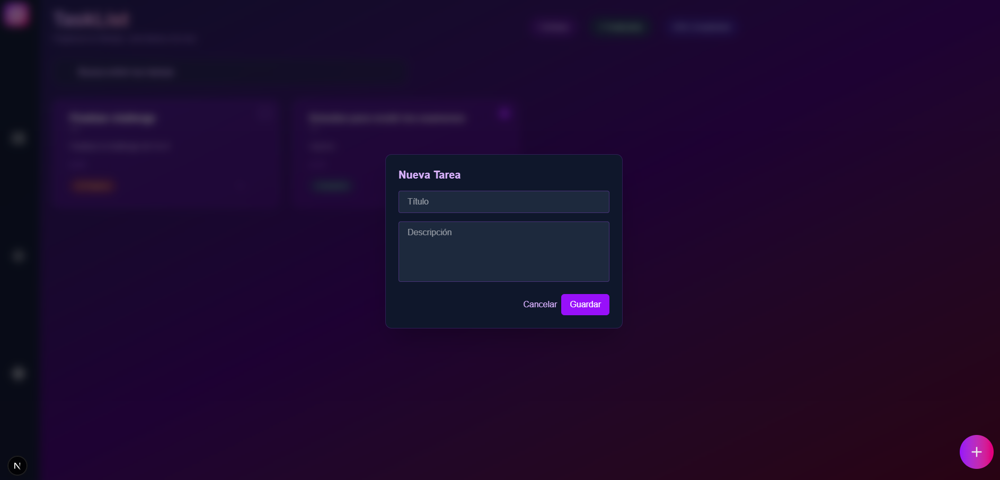

# Forit Todo

Aplicación de gestión de tareas (ToDo) con frontend en Next.js y backend en Node.js/Express + Prisma.

## Requisitos

- Node.js >= 18
- npm >= 8
- Base de datos SQLite (incluida por defecto con Prisma)

---

## 1. Clonar el repositorio

```sh
git clone https://github.com/KenaiiDev/forit-todo
cd forit-todo
```

---

## 2. Levantar el Backend

### Instalación de dependencias

```sh
cd backend
npm install
```

### Configuración de variables de entorno

Copia el archivo `.env.example` a `.env` y ajusta si es necesario.

```sh
cp .env.example .env
```

### Migrar la base de datos

```sh
npx prisma migrate deploy
```

### Iniciar el servidor

```sh
npm run dev
```

El backend estará corriendo en `http://localhost:3030` (puerto configurable en `.env`).

---

## 3. Levantar el Frontend

### Instalación de dependencias

```sh
cd ../frontend
npm install
```

### Configuración de variables de entorno

Copia el archivo `.env.example` a `.env` y asegúrate de que la variable `NEXT_PUBLIC_API_URL` apunte al backend, por ejemplo:

```
NEXT_PUBLIC_API_URL=http://localhost:3030/api
```

```sh
cp .env.example .env
```

### Iniciar el frontend

```sh
npm run dev
```

El frontend estará disponible en `http://localhost:3000`.

---

## 4. Uso

1. Accede a `http://localhost:3000` en tu navegador.
2. Puedes crear, editar, completar y eliminar tareas.
3. El estado se sincroniza automáticamente con el backend.

---

## 5. Capturas de pantalla

A continuación se muestran algunas capturas de pantalla de la aplicación:

### Vista principal


### Crear una tarea



### Editar y completar tareas


---

## Scripts útiles

- **Backend**

  - `npm run dev`: Inicia el backend en modo desarrollo.
  - `npx prisma studio`: Abre Prisma Studio para explorar la base de datos.

- **Frontend**
  - `npm run dev`: Inicia el frontend en modo desarrollo.
  - `npm run build`: Compila la aplicación para producción.

---
